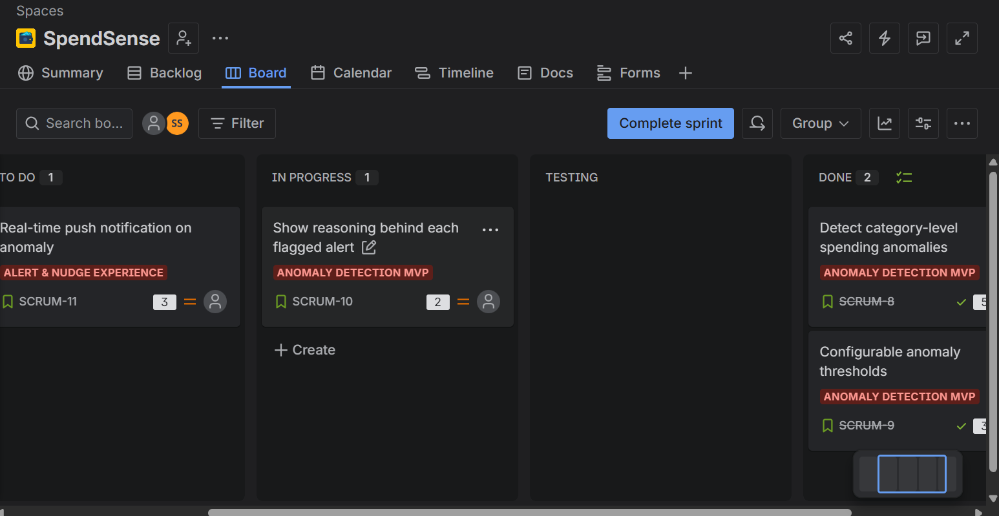
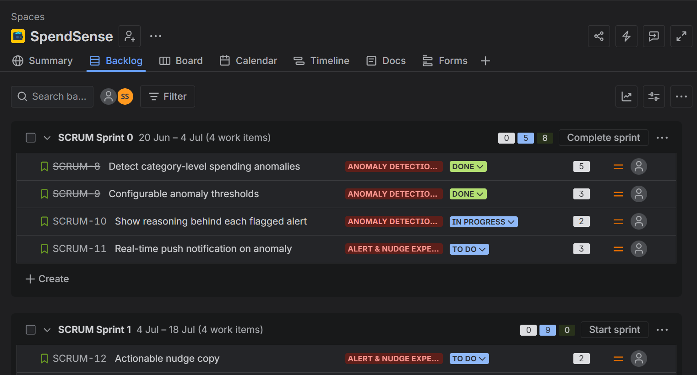
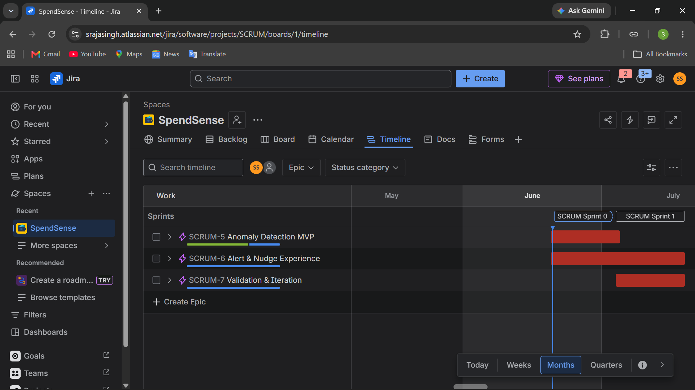
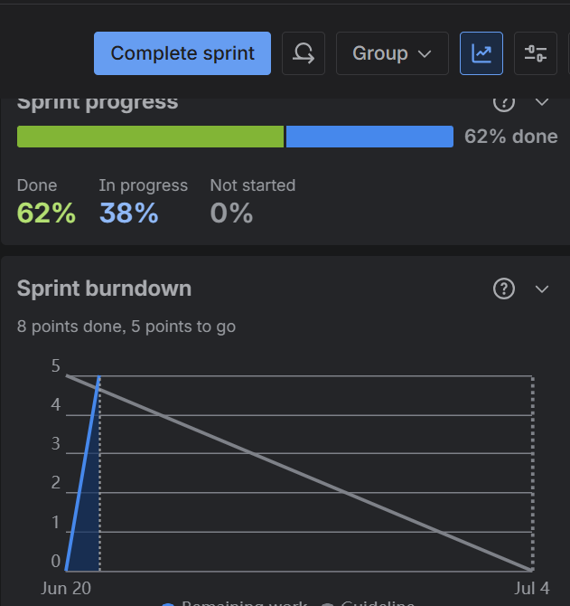

# SpendSense — Real-Time Spend Anomaly Alerts for Students
### Product Case Study | From Data Project to Product

---

## Overview

SpendSense extends the [Customer Spend Analytics](link-to-your-repo) project from a 
retrospective dashboard into a real-time, consumer-facing product. Where the original 
project answers "what did spending look like?", SpendSense answers "what should I do 
about it, right now?"

This document captures the product thinking, planning artifacts, and Jira execution 
behind the concept.

---

## Problem

Students managing irregular income (allowance, part-time work, freelance gigs) typically 
discover overspending only when checking their balance days later — by which point 
there's no opportunity to course-correct. Existing budgeting apps surface dashboards, 
but don't intervene in the moment that matters.

## Target User

College students managing tight, irregular budgets across frequent small transactions — 
food delivery, subscriptions, casual shopping.

## Solution

A lightweight detection-and-nudge system that:
1. Flags abnormal spending in a category in near real time
2. Delivers a specific, actionable nudge (not just a number)
3. Learns from user feedback (marking alerts as intentional)
4. Is validated through A/B testing of nudge tone, not assumption

## Success Metric

**% of flagged alerts resulting in user action within 24 hours** (dismiss-as-intentional, 
budget adjustment, or spending pause) — tracked by category and by nudge variant.

## Data Foundation

Built on the existing Customer Spend Analytics pipeline — ~128K Amazon India order 
dataset, RFM segmentation, and anomaly detection logic already validated in the 
underlying repo. SpendSense is the productization layer on top of that foundation.

---

## Product Structure

### Epic 1: Anomaly Detection MVP
Core engine that flags unusual spending using the existing analytics logic.

| Story | Description |
|---|---|
| Detect category-level spending anomalies | Flags transactions >2 std dev above 30-day category average |
| Configurable anomaly thresholds | Threshold adjustable without code deploy (default 2.0, range 1.5–3.0) |
| Show reasoning behind each flagged alert | Surfaces category, amount, average, and % deviation |

### Epic 2: Alert & Nudge Experience
The user-facing delivery layer.

| Story | Description |
|---|---|
| Real-time push notification | Sent within 1 minute of detection |
| Actionable nudge copy | Suggests a specific action, not a generic warning |
| Mark alert as intentional | User feedback loop that refines future thresholds |

### Epic 3: Validation & Iteration
Measuring whether the product actually changes behavior.

| Story | Description |
|---|---|
| A/B test nudge tone | Data-driven vs. friendly tone, 50/50 split, min. 200 users/variant |
| Track alert-to-action conversion rate | Dashboard broken down by category and variant |

---

## Sprint Execution

**Sprint 1** (13 points): Core detection, configurable thresholds, alert reasoning, push notifications
**Sprint 2** (9 points, planned): Nudge copy, feedback loop, A/B testing, conversion tracking

Sprint 1 reached **62% completion** with 8 of 13 points done, tracked via burndown chart.

### Screenshots

**Sprint Board** — active sprint with realistic To Do / In Progress / Done distribution

**Backlog** — epics, stories, acceptance criteria, story points

**Roadmap Timeline** — epics plotted across sprints

**Sprint Burndown** — velocity tracking, 8/13 points complete

---

## What This Demonstrates

- Translating an existing data asset into a product concept with a clear problem, user, 
  and success metric
- Structuring product work into epics, user stories, and measurable acceptance criteria
- Running Agile/Scrum execution in Jira — sprint planning, backlog grooming, velocity tracking
- Designing experimentation (A/B testing) as part of the roadmap, not an afterthought

---

*This is a planning and product-thinking exercise; SpendSense is not currently built as 
a live application. The underlying data and detection logic are implemented in the 
[Customer Spend Analytics](link-to-your-repo) project.*
