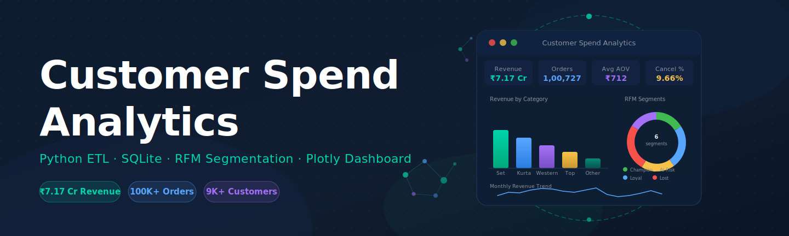
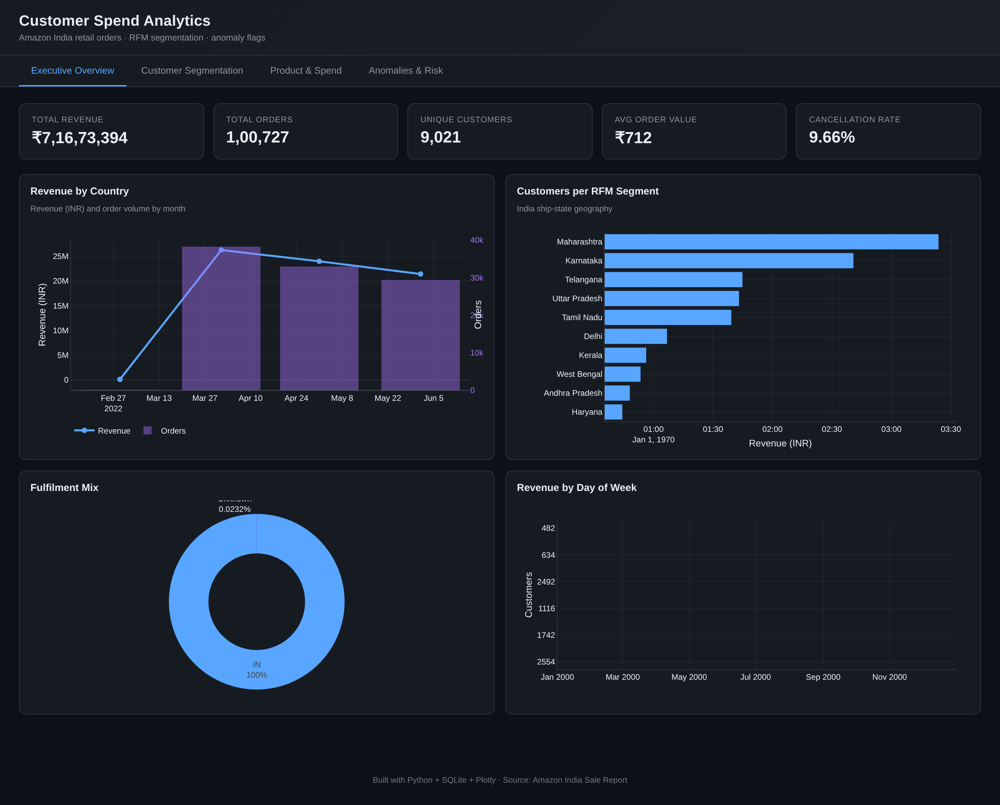
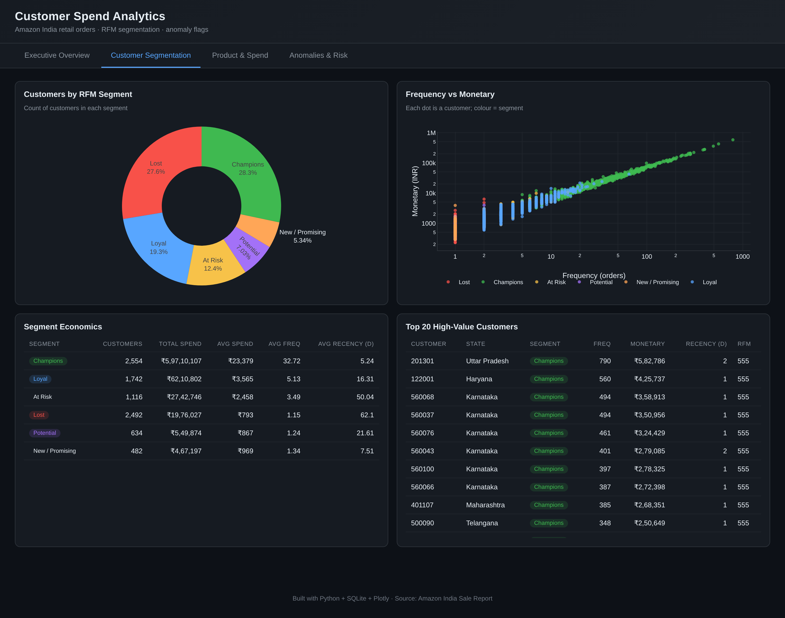
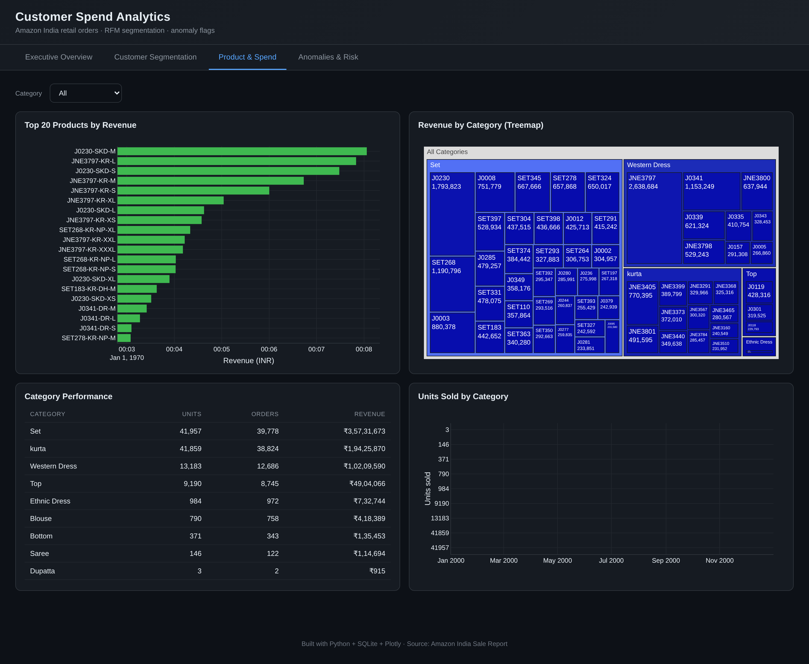
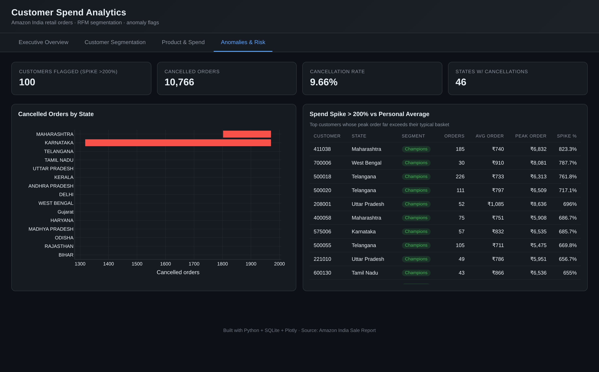

<div align="center">


<br/>


[](https://srajasingh.github.io/Customer-Spend-Analytics/)
&nbsp;
[](https://www.python.org/)
[](https://sqlite.org/)
[](https://plotly.com/)
[](https://powerbi.microsoft.com/)
[](LICENSE)

<br/>

> **End-to-end retail analytics pipeline** — Python ETL → SQLite → 10 SQL views → Power BI‑ready CSVs → 4-page interactive Plotly dashboard



</div>

---

## ⚡ Quick Links

| | |
|---|---|
| 🌐 **Live Dashboard** | [srajasingh.github.io/Customer-Spend-Analytics](https://srajasingh.github.io/Customer-Spend-Analytics/) |
| 📊 **Dataset** | [Amazon India Sale Report — Kaggle](https://www.kaggle.com/datasets/thedevastator/unlocking-amazon-s-sales-secrets-a-comprehensive) |
| 📁 **Power BI CSVs** | [`/exports`](./exports/) — one file per SQL view, ready to import |

---

## 📈 Key Metrics

<div align="center">

| Metric | Value |
|:---:|:---:|
| 🛒 Orders Processed | **1,00,727** |
| 👥 Customer Proxies | **9,021** |
| 💰 Total Revenue | **₹7.17 Cr** |
| 🧾 Avg Order Value | **₹712** |
| ❌ Cancellation Rate | **9.66%** |
| 🏆 Champions Identified | **2,554** |
| ⚠️ At-Risk Customers | **1,116** |
| 📍 Top State | **Maharashtra (₹1.22 Cr)** |

</div>

---

## 🗺️ Pipeline Architecture

```
raw CSV (128k rows)
   │
   ▼
[ etl_pipeline.py ]          ← clean, dedupe, feature-engineer, RFM scoring
   │
   ▼
SQLite — 4 tables             ← transactions · customers · products · cancelled_orders
   │
   ▼
[ analysis_views.sql ]        ← 10 business views (KPIs, segments, anomalies …)
   │
   ├──▶ CSV exports/          ← drop into Power BI / Tableau / Excel
   └──▶ data.json             ← pre-aggregated bundle for the HTML dashboard
                                         │
                                         ▼
                              [ docs/index.html ]   ← 4-page Plotly dashboard (GitHub Pages)
```

---

## 🖥️ Dashboard Tour

### 1 · Executive Overview
KPI cards · monthly revenue + order trend (dual-axis) · top-10 states · revenue by country · orders by month


### 2 · Customer Segmentation
RFM donut · log-log frequency-vs-monetary scatter coloured by segment · segment economics table · top-20 high-value customers



### 3 · Product & Spend
Top-20 SKUs by revenue · category × style treemap (drill-down) · category performance table · units-by-category · category slicer filters every chart



### 4 · Anomalies & Risk
Spend-spike flags (peak order > 200% of personal avg) · cancellations by state · cancellation KPIs



---

## 🛠️ Tech Stack

| Layer | Tool | Role |
|---|---|---|
| ETL | Python · Pandas · NumPy | Extract, clean, feature-engineer, RFM scoring |
| Storage | SQLite | Relational analytics layer (MySQL-swappable) |
| Business Logic | SQL views | KPIs, segments, anomalies, cancellations |
| Visualisation | Plotly.js (single-file HTML) | 4-page interactive dashboard |
| BI Hand-off | CSV exports | Power BI / Tableau / Excel ready |
| Hosting | GitHub Pages | Zero-cost live dashboard |

---

## 📂 Project Structure

```
customer-spend-analytics/
├── data/
│   └── amazon_sale_report.csv        # raw input (download from Kaggle — 66 MB)
├── etl/
│   ├── etl_pipeline.py               # clean + RFM + load to SQLite
│   └── export_views.py               # dump views as CSV + dashboard JSON
├── sql/
│   ├── schema.sql                    # indexes + canonical column contract
│   └── analysis_views.sql            # 10 business views
├── db/
│   └── analytics.db                  # generated SQLite (gitignored)
├── exports/                          # one CSV per view → Power BI ready
├── docs/
│   ├── index.html                    # interactive Plotly dashboard (GitHub Pages)
│   └── data.json                     # pre-aggregated JSON bundle
├── images/                           # README screenshots
├── requirements.txt
├── LICENSE
└── README.md
```

---

## 🚀 Quick Start

```bash
# 0) Download raw data (66 MB — not committed due to GitHub limits)
#    → https://www.kaggle.com/datasets/thedevastator/unlocking-amazon-s-sales-secrets-a-comprehensive
#    → Save as: data/amazon_sale_report.csv

# 1) Install dependencies
pip install -r requirements.txt

# 2) Run ETL  (raw CSV → SQLite)
python etl/etl_pipeline.py \
    --input data/amazon_sale_report.csv \
    --db    db/analytics.db

# 3) Export views  (SQLite → CSV + dashboard JSON)
python etl/export_views.py

# 4) Preview dashboard locally
python -m http.server 3000 --directory docs
# → open http://localhost:3000
```

---

## 🔍 ETL Deep Dive

| Step | What happens |
|---|---|
| **Extract** | Load raw Amazon CSV; drop `Unnamed`/`index` columns; snake-case all headers |
| **Clean** | Parse `Date` (mm-dd-yy); drop rows missing `amount`/`date`/`order_id`; isolate `Cancelled` rows; filter non-positive `qty`/`amount`; title-case state/city fields |
| **Engineer** | Derive `year`, `month`, `year_month`, `day_of_week`, `total_amount` |
| **RFM Score** | Segment 9k+ customer proxies (postal code) by Recency · Frequency · Monetary quintiles → 6 labels + `is_high_value` flag |
| **Load** | Insert into 4 SQLite tables; execute `schema.sql` + `analysis_views.sql` |

---

## 🗃️ SQL Views Reference

| View | Purpose |
|---|---|
| `vw_kpis` | Revenue · orders · customers · AOV · cancellation rate |
| `vw_monthly_revenue` | Revenue / orders / customers by month |
| `vw_customer_segments` | Count + economics per RFM segment |
| `vw_top_products` | Top-20 SKUs by revenue |
| `vw_top_customers` | Top-20 high-value customers |
| `vw_country_spend` | Revenue totals by country |
| `vw_state_spend` | Revenue totals by Indian ship-state |
| `vw_category_spend` | Units / orders / revenue by garment category |
| `vw_anomalous_customers` | Customers with peak order > 200% of personal average |
| `vw_cancellation_by_state` | Cancelled order counts + value by state |

> All views are exported to `exports/<view>.csv` — **Get Data → Folder → exports/** in Power BI.

---

## 📝 Resume Bullets

```
• Built end-to-end ETL pipeline in Python processing 128k+ retail transactions into
  a relational SQLite store with indexed schema and 10 reusable SQL analytics views.

• Engineered RFM-based customer segmentation to classify 9,021 customer proxies into
  6 risk/value tiers — surfacing 2,554 Champions and 1,116 At-Risk buyers.

• Delivered a 4-page interactive Plotly dashboard (live on GitHub Pages) and
  Power BI-ready CSV exports with KPI tracking, geographic trends, and anomaly
  flagging for spend spikes and cancellations.
```

---

## 📄 License

[MIT](LICENSE) · Made with ❤️ by [Sraja Singh](https://linkedin.com/in/sraja-singh)
